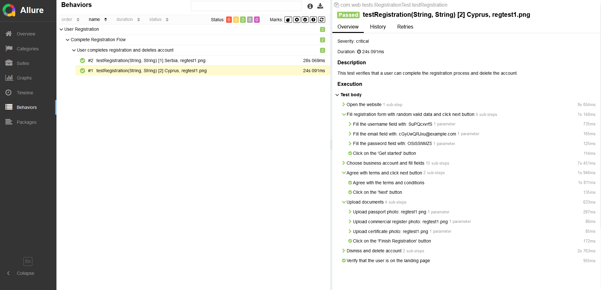

# Wisebits Test Automation Project

## Project Structure

- **`src/main/java`**: Main project code (Page Objects, utilities, configuration).
- **`src/test/java`**: Test classes.
- **`src/test/resources`**: Resources for tests (configuration files, images for upload).
- **`pom.xml`**: Maven configuration file.

## How to Run the Project

### Prerequisites

1. Install **Java 11** or higher.
2. Install **Maven**.
3. Install **Google Chrome** (or another browser if you change the settings in `config.properties`).

### Running Tests

- mvn clean test

### Viewing Allure Reports

1. After running the tests, generate the Allure report:
- mvn allure:serve

2. If you want to save the report as static files, run:
- mvn allure:report

The report will be saved in the target/site/allure-maven-plugin folder.

Report example:

